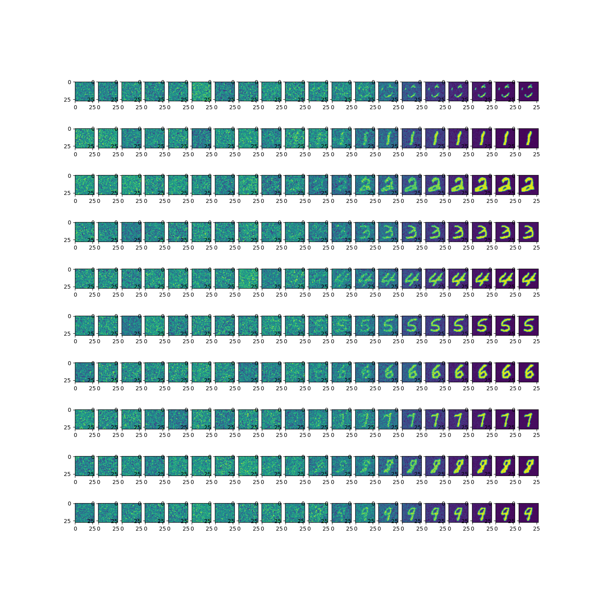

## 模型结构

- DiT模型本质上是diffusion扩散模型
- 图像部分的unet卷积网络换成了vits网络
- EDM 将 ADM框架中的 `timestep` 改为 `sigma`


## 训练

```
python train.py

epoch:0 iter:0,loss:3555.958740234375
epoch:8 iter:1000,loss:419.59246826171875
epoch:16 iter:2000,loss:361.26116943359375
epoch:25 iter:3000,loss:322.7470703125
epoch:33 iter:4000,loss:281.6904296875
epoch:41 iter:5000,loss:290.2489929199219
epoch:50 iter:6000,loss:273.3714294433594
epoch:58 iter:7000,loss:248.0279998779297
epoch:66 iter:8000,loss:262.88800048828125
epoch:75 iter:9000,loss:269.1307678222656
epoch:83 iter:10000,loss:255.38072204589844
epoch:91 iter:11000,loss:252.18609619140625
...
```

## 生成

扩散生成0~9对应的图片

```
python MainInference.py
```




## 参考论文

[Scalable Diffusion Models with Transformers](https://www.wpeebles.com/DiT)

[Elucidating the Design Space of Diffusion-Based Generative Models](https://arxiv.org/abs/2206.00364v2)